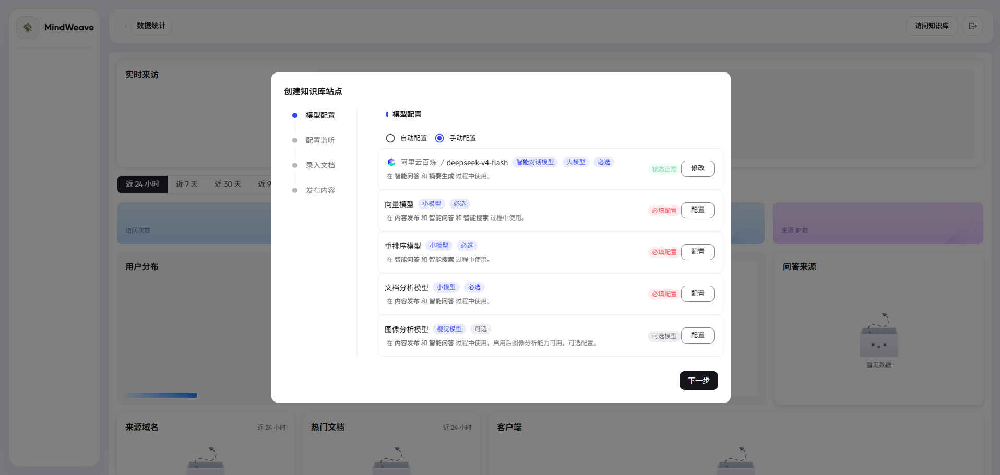
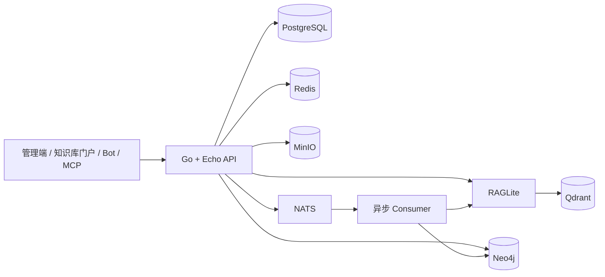

<p align="center">
  
</p>

<h1 align="center">MindWeave</h1>

<p align="center">
  基于多模态内容理解、RAG 与知识图谱的智能知识库问答系统
</p>

<p align="center">
  <a href="./docs/DEPLOY_LOCAL_DOCKER.md">本地部署</a> ·
  <a href="./docs/DEPLOY_UBUNTU_CUSTOM.md">Ubuntu 部署</a> ·
  <a href="./docs/MindWeave_FAQ.md">常见问题</a> ·
  <a href="./PROJECT_STRUCTURE.md">项目结构</a>
</p>

## 项目简介

MindWeave 是一套以知识库为业务边界的知识生产、治理、发布与问答平台。系统支持从文件、网页和第三方内容平台导入知识，通过 RAG 完成语义检索与流式问答，并将知识库、目录、文档和用户等对象同步至 Neo4j，提供 2D/3D 知识图谱探索能力。

项目采用 Go API、异步 Consumer 与双前端架构：管理端用于内容和模型配置，门户端面向最终用户提供文档浏览与 AI 问答；PostgreSQL、Redis、MinIO、Qdrant、RAGLite、Neo4j 和 NATS 共同提供数据与基础设施能力。



## 核心能力

- **多源知识接入**：支持 PDF、Word、Markdown、图片 OCR、网页 URL、RSS、Sitemap，以及 Notion、语雀、飞书文档等来源。
- **RAG 检索增强问答**：文档发布后自动切片、向量化和索引；问答链路包含问题改写、语义召回、重排序、证据引用与 SSE 流式输出。
- **多模态模型配置**：可分别配置对话、向量、重排序、文档分析和图像分析模型。
- **知识图谱**：将核心业务对象同步至 Neo4j，基于内容相似度构建文档关系，并提供 2D/3D 交互式可视化。
- **可靠的图谱同步**：异步同步任务支持退避重试、死信记录和按知识库手动重放。
- **多渠道发布**：支持知识库门户、网页挂件、OpenAI 兼容接口、MCP，以及钉钉、飞书、企业微信等机器人渠道。
- **版本化发布**：区分编辑态与服务态，以发布快照作为检索和问答对象，便于追溯内容来源。

## 系统架构



## 技术栈

| 层级       | 主要技术                                         |
| ---------- | ------------------------------------------------ |
| 后端       | Go 1.24、Echo、GORM、JWT                         |
| 管理端     | React 19、TypeScript、Vite 6、MUI、Redux Toolkit |
| 门户端     | Next.js 16、React 19、TypeScript、MUI            |
| 内容与检索 | RAGLite、Qdrant、MinIO                           |
| 数据与消息 | PostgreSQL、Redis、NATS                          |
| 知识图谱   | Neo4j、Graphology、Sigma.js、Three.js            |
| 部署       | Docker Compose、Caddy、Nginx                     |

## 目录结构

```text
MindWeave/
├── backend/              # Go API、Consumer、迁移与领域逻辑
├── web/
│   ├── admin/            # React/Vite 管理端
│   ├── app/              # Next.js 知识库门户
│   └── packages/         # 前端共享组件与主题
├── sdk/rag/              # RAG SDK
├── docs/                 # 部署、设计与项目文档
├── images/               # README 图片资源
└── README.md
```

更完整的说明请查看 [PROJECT_STRUCTURE.md](./PROJECT_STRUCTURE.md)。

## 快速开始

### 环境要求

- Git
- Node.js 22（推荐）与 Corepack
- pnpm 10.12.1
- Go 1.24.3（开发后端时需要）
- Docker 与 Docker Compose v2（运行完整服务时需要）

### 获取源码

```bash
git clone https://github.com/Gray878/MindWeave.git
cd MindWeave
```

### 启动前端开发环境

前端开发服务器默认将 API 请求代理到 `http://localhost:8000`。请先启动后端服务，或修改 `web/admin/.env` 与 `web/app/.env` 中的目标地址。

```bash
cd web
corepack enable
pnpm install --frozen-lockfile
pnpm dev
```

默认开发地址：

- 管理端：`http://localhost:5173`
- 知识库门户：`http://localhost:3010`

构建全部前端应用：

```bash
cd web
pnpm build
```

运行后端测试：

```bash
cd backend
go test ./...
```

## 部署

本项目的定制部署采用“两层目录”：Git 仓库保存于部署根目录下的 `PandaWiki/`，而 `.env`、Compose 文件、运行数据和编译后的 API 位于外层部署根目录。请不要直接套用普通单仓库 Compose 项目的目录假设。

- macOS / Windows Docker Desktop：[本地 Docker 部署](./docs/DEPLOY_LOCAL_DOCKER.md)
- Ubuntu 22.04 / 24.04：[Ubuntu 云服务器部署](./docs/DEPLOY_UBUNTU_CUSTOM.md)
- 后端单独部署：[后端部署说明](./docs/deploy-backend.md)

生产环境建议至少准备 4 核 CPU、8 GB 内存和 40 GB 可用磁盘；文档量较大或同时运行 Neo4j、Qdrant 时，建议使用 8 核 16 GB 及以上配置。

## 使用流程

1. 登录管理端并创建知识库。
2. 配置对话、向量、重排序、文档分析等模型。
3. 导入文档，整理目录并发布内容。
4. 在门户中验证检索与 AI 问答效果。
5. 在图谱页面查看实体关系，并按需配置机器人、OpenAI API 或 MCP 渠道。

遇到模型配置、端口映射、图谱同步或部署问题时，请先查看 [MindWeave FAQ](./docs/MindWeave_FAQ.md)。

## 参与贡献

欢迎通过 Issue 或 Pull Request 参与改进。提交代码前请阅读 [CONTRIBUTING.md](./CONTRIBUTING.md)；安全问题请按照 [SECURITY.md](./SECURITY.md) 中的方式反馈。

## 开源许可

本项目基于开源项目二次开发，并使用 [GNU Affero General Public License v3.0](./LICENSE)。分发修改版本或通过网络提供服务时，请遵守 AGPL-3.0 的源代码公开要求。
